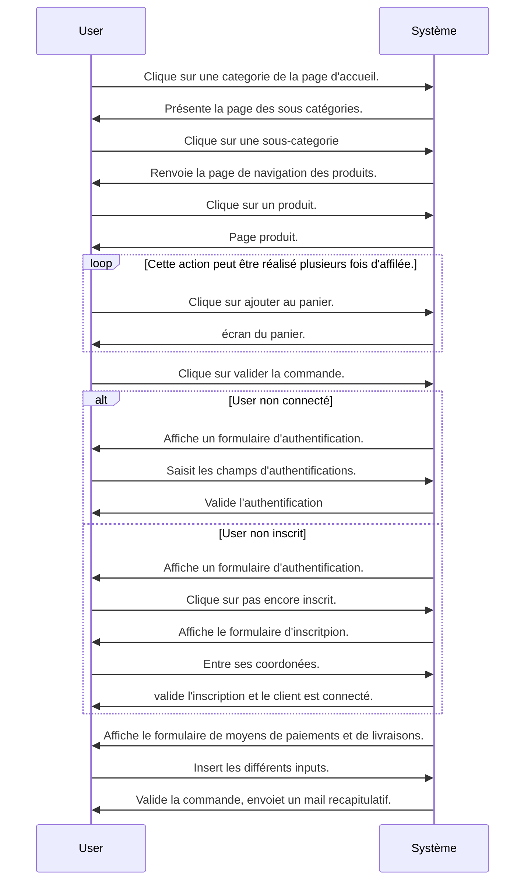

# Qreen-Village
Site d'inspiration e-commerce conçu dans le cadre de ma Formation Concepteur développeur d'application 

L'objectif fil rouge de la formation était de concevoir 3 applications : 
 - [Une application Web](https://quentin.amorce.org)
 - [Une application Desktop](https://github.com/quentin-derycke/GreenVD)  
 - [Une application Mobile](https://github.com/quentin-derycke/NativeVillage)
 
 
 ## Stack:
 

  -  Bootsrap
  - <a href="https://symfony.com" target="_blank" rel="noreferrer">  Symfony
 - <a href="https://api-platform.com" target="_blank" rel="noreferrer">  
 
  # Attendus : 
  
  ## L'application Web réaliser avec le framework Symfony contient les fonctionalités suivantes : 
  
  - Consultation du catalogue
  - Ajout/Suppression de produit dans le panier
  - Inscription d'un nouvel utilisateur sur le site (pour les particuliers)
  - Connexion/Deconnexion d'un utilisateur pour accéder à son profil
  - Validation du panier pour créer une nouvelle commande ()
  - Visualisation des anciennes commandes
  
  
  
  
  
  ##  Shema de conceptions : 
  
  ### MCD

### Diagramme des cas d'utilisations

###Scenario d'utilisation

**Commande Point de vue Client**

|Description|
|-----------|
 Ce cas d’utilisation a pour but de décrire  le parcours effectué  par l’utilisateur,  afin de saisir des produits dans son panier puis  valider une commande.

|Conditions|
|-----------|
Le Client est sur la page d’accueil, accéde aux catégories, selectionne 1 ou plusieurs produits, les met dans son panier et paie.

|Resultat|
|-----------|
Une commande est validée.

|Flot Nominal| 
|-----------|
&rarr; Le client clic sur une categorie de la page d'accueil.
&larr; le systéme lui presente la page des sous-categories.
&rarr; le client clic sur une sous-categorie.
&larr; le systéme renvoie la page de navigation des produits.
&rarr; le client clic sur un produit.
&larr; le systéme lui renvoie la page du produit.
&rarr; Le client clic sur ajouter au panier.  
&larr; Le systéme affiche l'écran du panier.( Cette opération peut être réalisée pusieurs fois d'affilée).
&rarr; Le client clic sur valider la commande.
&larr; Le systeme affiche un formulaire de selection de moyen de paiment. et de l'adresse de livraison.
&rarr; Le client remplit les différents inputs.
&larr; le système valide la commande et envoies un mail avec le recapitulatif de la commande. 

|Flot Alternatif:|User non connecté| 
|-----------|-------------
&rarr;  Quand Le client clic sur valider la commande. 
&larr; L'application afiiche un formulaire d'authentification.
&rarr; le client saisit les champs d'authentification.
&larr; le systéme valide l'authentification.
&harr; Le flot nominal reprend.

|Flot Alternatif:|User non inscrit| 
|-----------|-------------
&rarr;  Quand Le client clic sur valider la commande. 
&larr; L'application affiche un formulaire d'authentification
&rarr; le client clic sur pas encore inscrit
&larr; Le système affiche le formulaire d'inscritpion
&rarr; Le client entre ses coordonées
&larr; Le système valide l'inscription et le client est connecté.
&harr; Le flot nominal reprend.

### Diagramme de Séquence 

### Diagramme d'activité 

###Diagramme de classe

